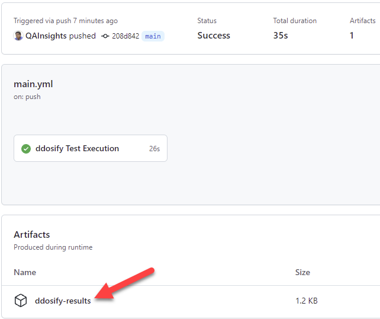

# About ddosify action

[](https://dev.to/qainsights/ddosify-action-20ae)
[](https://saythanks.io/to/catch.nkn%40gmail.com)
[](https://qainsights.com)
[](https://qainsights.com)
[](https://www.youtube.com/user/QAInsights?sub_confirmation=1)

ddosify GitHub action for dev.to hackathon.


# How to use this GitHub Action?

## Prerequisites
Following are the prerequisites for this GitHub Action:

* `args`
  * Mandatory

## Usage

### Example 

```
- name: Ddosify Test
  uses: QAInsights/ddosify-action@v1.0.1
  with:
    args: "-t example.com"
    
- name: Upload Results
  uses: actions/upload-artifact@v2
  with:
    name: ddosify-results
    path: ./*.log
```

## Download Test Results

By default, this GitHub Action will log the performance statistics under `*.log`. After the execution, it will be uploaded to the GitHub artifacts.

To download the results, go to your `Actions` and then click on the executed workflow, then click on the workflow run to download the log.

